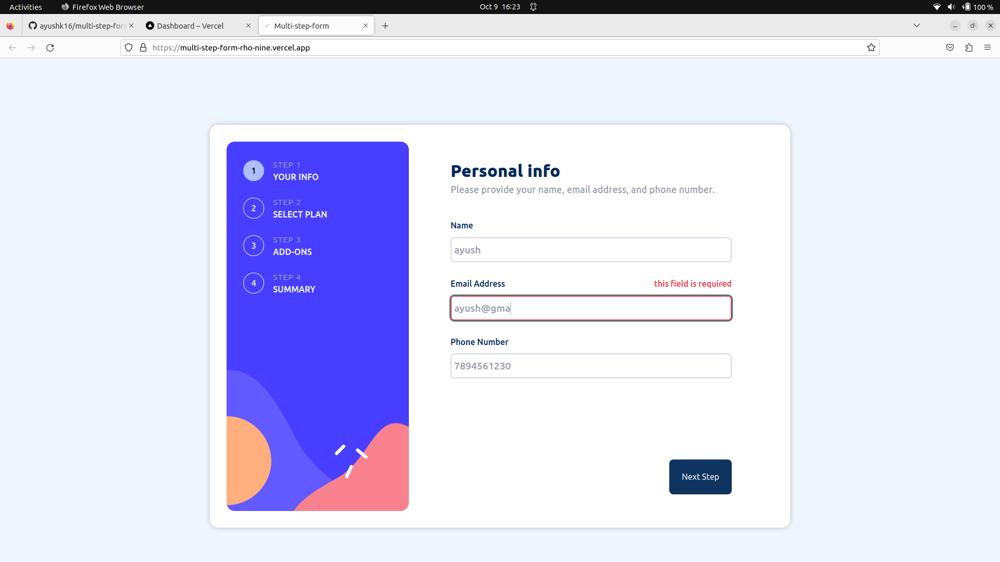
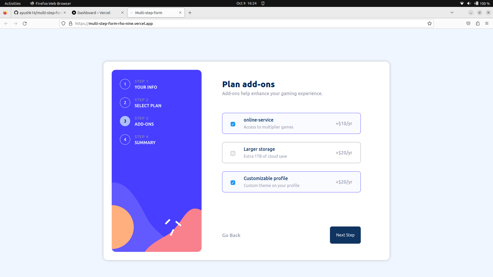
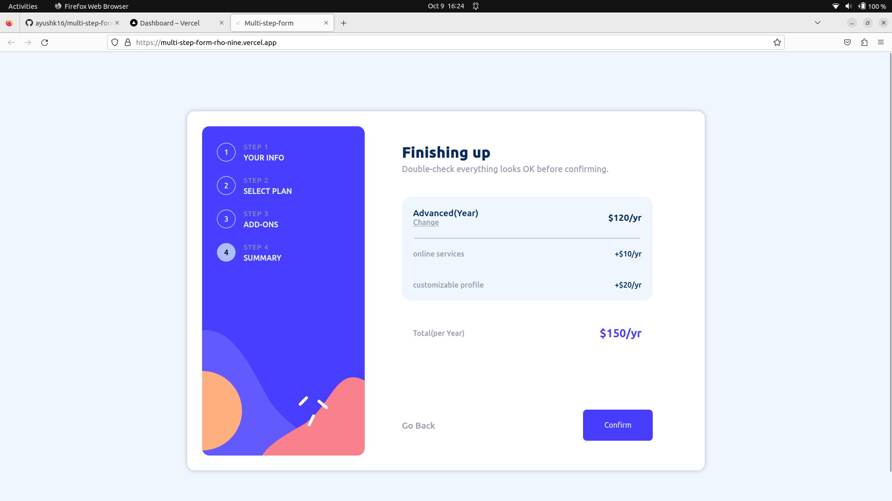
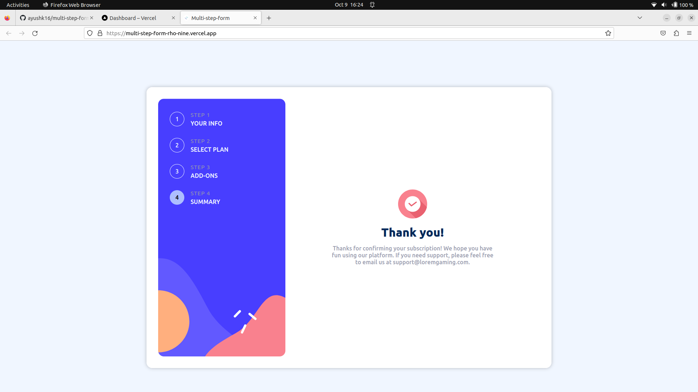
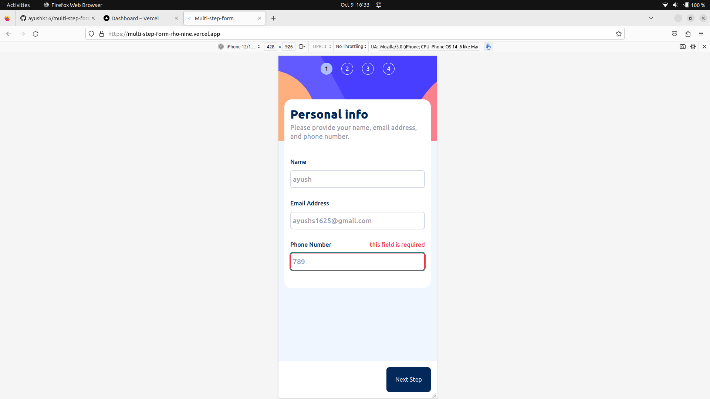
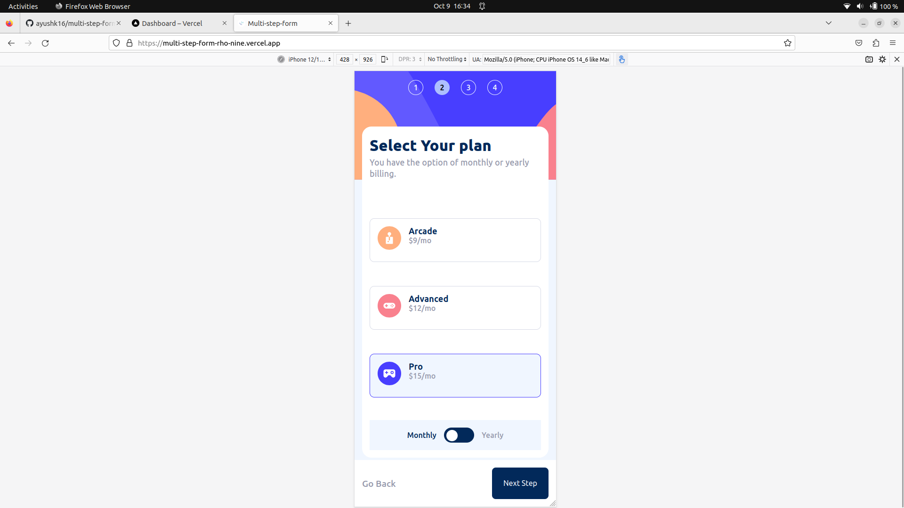
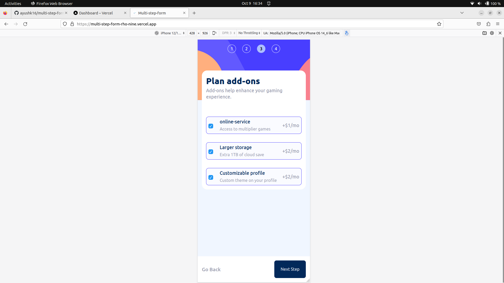
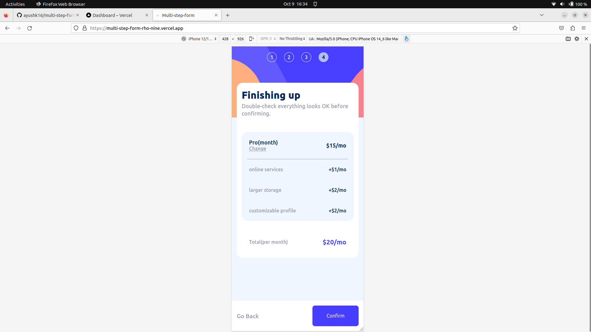
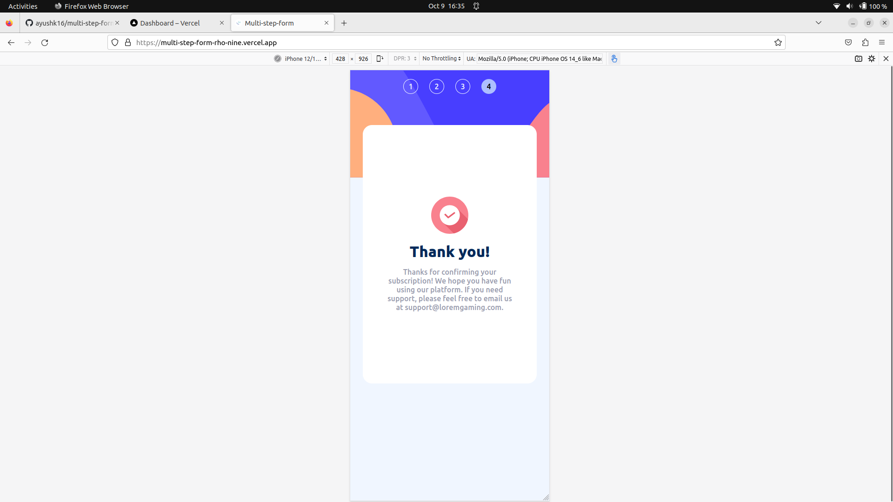

## Index

- [Overview](#overview)
  - [The challenge](#the-challenge)
  - [Screenshot](#screenshot)
  - [Links](#links)
- [My process](#my-process)
  - [Built with](#built-with)
  - [What I learned](#what-i-learned)
  - [Continued development](#continued-development)
  - [Useful resources](#useful-resources)
- [Getting Started](#getting-started)
- [Contribute](#contributing)

**Note: Delete this note and update the table of contents based on what sections you keep.**

## Overview

### The challenge

Users should be able to:

- Complete each step of the sequence
- Go back to a previous step to update their selections
- See a summary of their selections on the final step and confirm their order
- View the optimal layout for the interface depending on their device's screen size
- See hover and focus states for all interactive elements on the page
- Receive form validation messages if:
  - A field has been missed
  - The email address is not formatted correctly
  - A step is submitted, but no selection has been made

### Screenshot

#### Following are some screen shots of the web page

- for desktops
  
  
  
  
  

- for mobiles
  
  
  
  
  

### Links

- GitHub Code URL: [github.com/ayushk16](https://github.com/ayushk16/multi-step-form)
- Live Site URL: [Vercel App Link](https://multi-step-form-rho-nine.vercel.app)

## My process

### Built with

- Semantic HTML5 markup
- Root variables in css
- CSS custom properties
- CSS Flexbox
- Desktop-first workflow

### What I learned

1. How can we use objects and arrays to make our forms updated at each and every step to make it more user friendly.
2. Also we can give dynamic values like prices to our plans and add ons, set what plans and addons should be preselected on user page.
3. I've used functional programing in javascript.
4. Different DOM manipulation practices.
5. And many more good codding practices.

### Continued development

1. Using localstorage to store dynamic objects and keep them stay there to auto fill user prefrences.

2. Using react to make page more smooth and more light for browser

### Useful resources

- [mdn docs for javascript](https://developer.mozilla.org/en-US/docs/Web/JavaScript) - This helped me building knowledge about various javascript concepts.
- [w3 schools for css](https://www.w3schools.com/css/default.asp) - This helped me building knowledge about css properties like flex, display, positioning, etc.
- Rest i've googled.

## Getting Started

To get started with this portfolio template, follow these steps:

1. Clone this repository to your local machine.

```
git clone https://github.com/ayushk16/multi-step-form
```

2. Make Suitable Changes.

## Contributing

If you'd like to contribute to this project, please follow these steps:

1. Fork the repository on GitHub.
2. Create a new branch from the main branch for your changes.
3. Make your changes and commit them.
4. Push your changes to your fork.
5. Create a pull request to the main branch of this repository.
6. Follow me on github [github.com/ayushk16](https://github.com/ayushk16)
